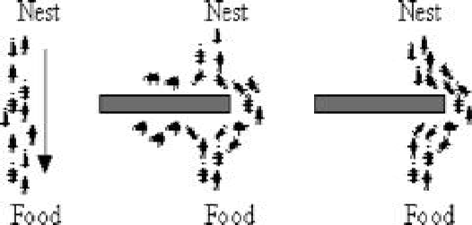
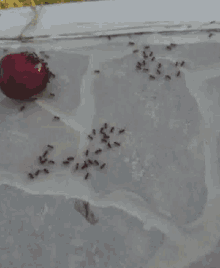
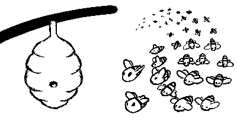

# Implementation of a Simple Swarm Engine

Swarms are naturally observed in insects and animals, where the individual activity
are suppressed by the group will. 

An example is the Ant Swarm process. Ants use a process of stochastic local decision by two main factors: Pheromone and heuristic.
The intensity of the first means the probable number of ants that passed through that way. So the good paths are reinforced by multiple ants
advancing, and the Bad Paths are often forgotten and gives less pheromone strength, making less and less ants pass through it.

Other example are the Bee Swarm. Bees are separated in three classes: Employed, Scout Bees and the Onlooker.
Scout Bees looks for fresh food sources, when found, they mark the source with a fitness quotient. If the employed
bees find the marked food source and the quotient are higher than the last ones, it is marked for further processing.
The employed bees update its database with newer and better food. Lastly the Onlooker bees filter for the best 
food sources.

 

Programming in C, we are using a simple 2D Physics simulator to act as our engine, as seen in the [2D Physics Example](https://github.com/Beloin/2DPhysicsSimulator).
To show some interface we are using OpenGL with GLFW and GLAD framework to manage our pointers and startup.

In our simulation, we will only use a [Boids-like simulation](https://en.wikipedia.org/wiki/Boids),
comparing by the proximity of the organisms. We have a swarm moving on its way
and a single organism stopped. When the Swarm pass close by the Organism, they are attracted to the swarm,
moving closely to swarm without knowing where they are going.

## One Organism Attraction Example

## Multiple Organism Attraction Example

Here we calculate the Centroid of all the points in order to keep track to where to go.

To show more on another Axis:

And, of course, if the Swarm is not close enough, the organism will not move at all:

## Multiple Organisms to be Attracted

## References

- An iterative video can be found [here](https://www.youtube.com/watch?v=nyayWLpcIGo&ab_channel=Zidbits)!
- Chakraborty, A., Kar, A.K. (2017). Swarm Intelligence: A Review of Algorithms. In: Patnaik, S., Yang, XS., Nakamatsu, K. (eds) Nature-Inspired Computing and Optimization. Modeling and Optimization in Science and Technologies, vol 10. Springer, Cham. https://doi.org/10.1007/978-3-319-50920-4_19
- [Boids](https://en.wikipedia.org/wiki/Boids), Wikipedia.

